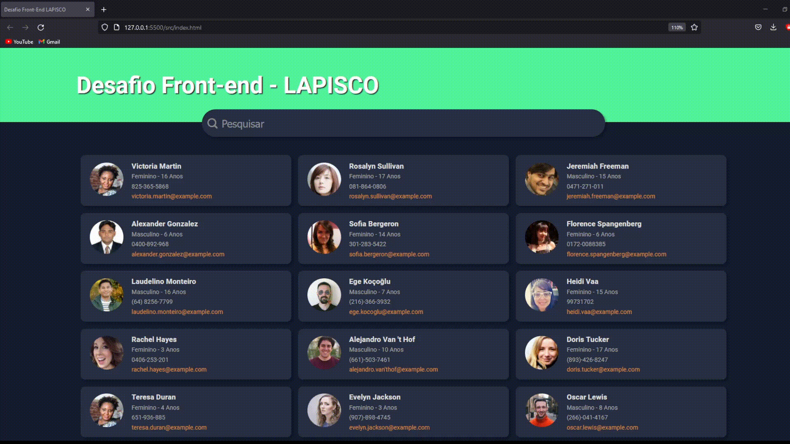

# Desafio Front-end LAPISCO

Página com busca integrada com consumo da API [Random User](https://randomuser.me)

## Demo

Lista diversos usuários e permite a busca pelo nome.
[Teste aqui](https://lapisco.vercel.app/)

## Features

Além do que foi originalmente requisitado, implementei algumas features extras:
- Infinite Scroll: Carrega mais cards automaticamente ao scrollar até o final da página
- Animação de carregamento: Enquanto não recebe os dados, exibe uma animação de carregamento para melhor experiência de usuário.
- Responsividade: Responde e adapta a diferentes tamanhos de tela.
- Melhorias visuais: Alguns efeitos de estilização e redesign do header e barra de pesquisa.
